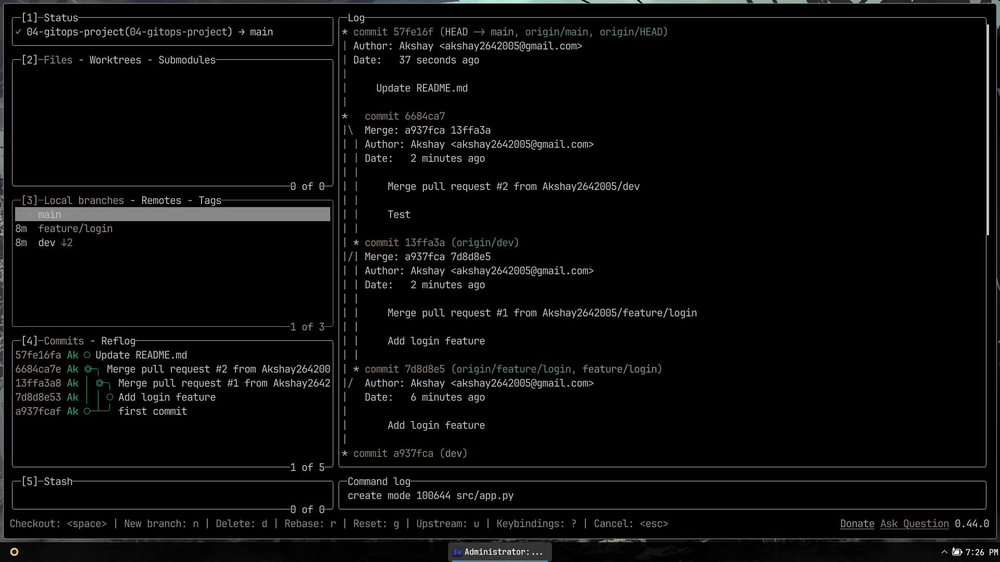

# DevOps Git Workflow Project

## 📌 Overview
This project demonstrates proper **Git version control** practices using branching, commits, pull requests, and tags.

## 🛠 Tools Used
- Git
- GitHub

## 📂 Branching Structure
- **main** → Production-ready code
- **dev** → Integration of new features before release
- **feature/*** → Each feature in its own branch

## 🚀 Getting Started
### 1. Clone the Repository
```bash
git clone https://github.com/Akshay2642005/04-gitops-project.git
cd 04-gitops-project
```

### 2. Create Branches
```bash
git checkout -b dev
git checkout -b feature/login
```

### 3. Make Changes & Commit
```bash
git add .
git commit -m "Add login feature"
git push origin feature/login
```

### 4. Merge Using Pull Requests
1. Push branch to GitHub
2. Create PR → Merge into `dev`
3. Test → Merge `dev` into `main`

## 🗂 Git Tags
```bash
git tag v1.0.0
git push origin v1.0.0
```
## 📷 Screenshots



## 📄 Documentation
All Git commands and workflow steps are documented in [`docs/workflow.md`](docs/workflow.md).
